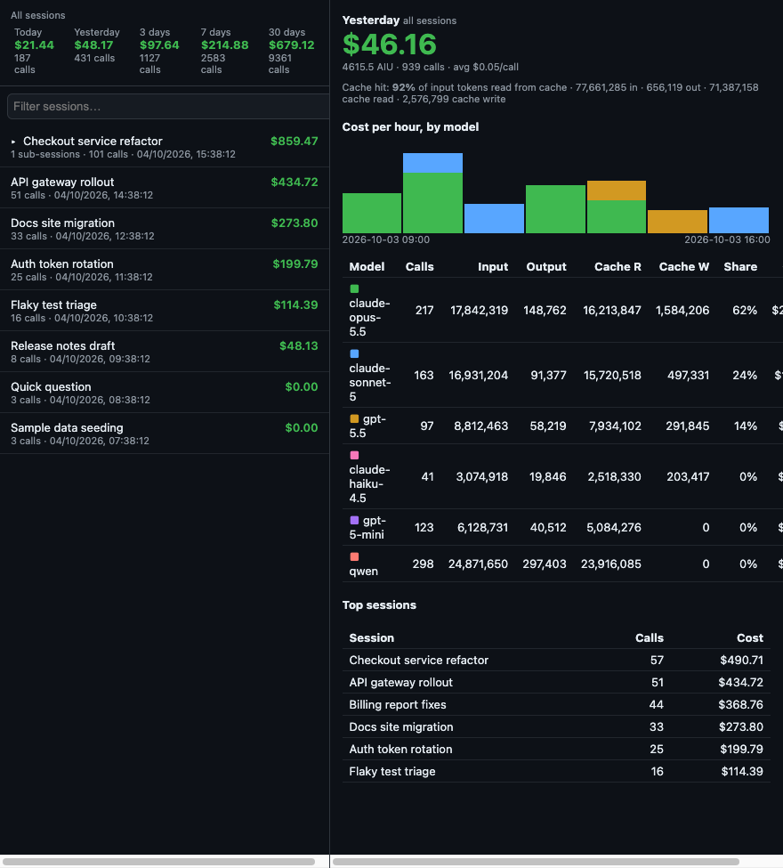

# copilot-session-costs

A GitHub Copilot App canvas extension that lists your Copilot sessions and shows cost (AIU / USD), rate of change (last call, last 10, last hour), totals (today, yesterday, 3/7/30 days), parent/child grouping and per-model token breakdowns.

## Install

**Ask an agent:**

> Install the extension from https://gist.github.com/kewalaka/dc801a20efd8a9dec6319df1dc83f7ed to user scope.

**Manual:**

- Open the Canvas menu → Discover more → Import canvas from gist/URL
- Paste `https://gist.github.com/kewalaka/dc801a20efd8a9dec6319df1dc83f7ed`
- Choose User scope (~/.copilot)
- Open the "Session costs" canvas

## Caveats

- Assumes 1 AIU = $0.01 (`AIU_USD` in `extension.mjs`).
- Reads the app's local SQLite stores read-only; internal schemas may change without notice.
- Requires a Node runtime with `node:sqlite`.
